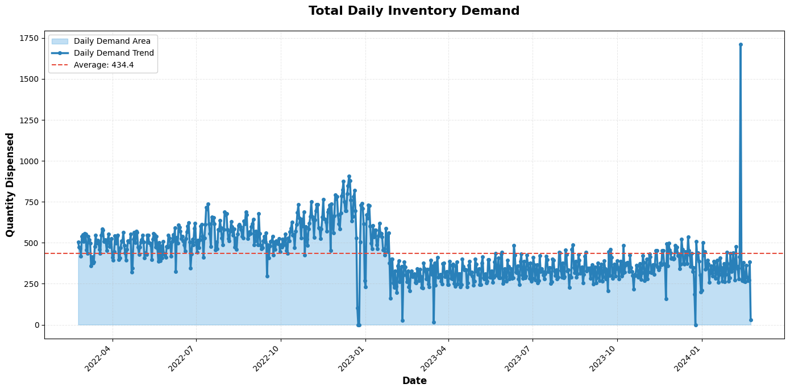
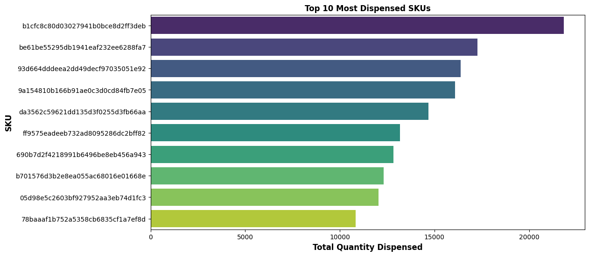
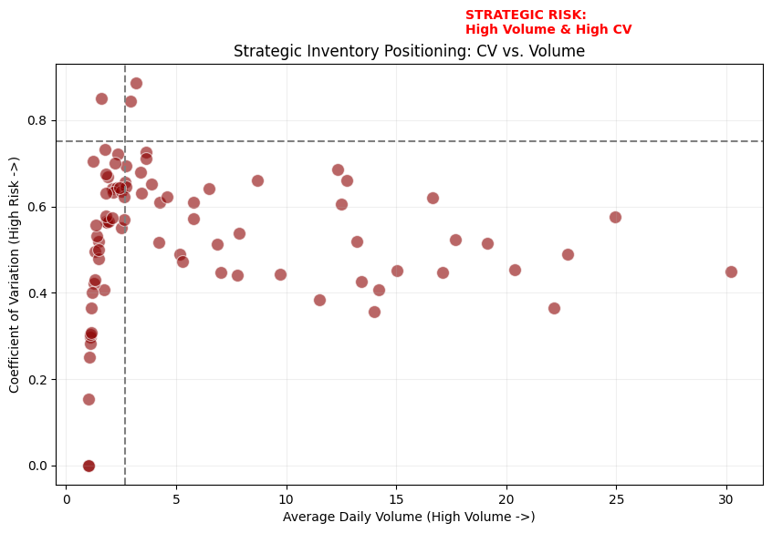
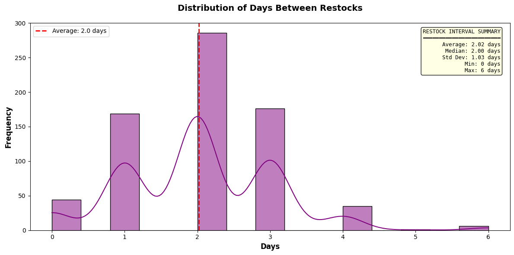
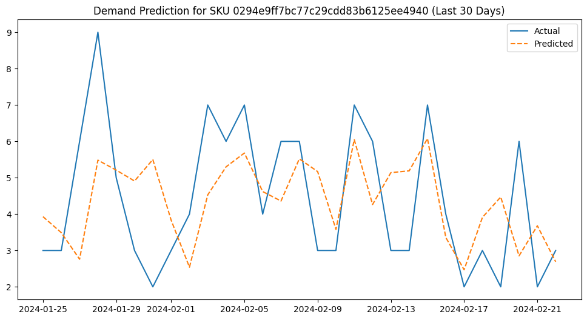

# 📊 Industrial Vending AI: Predictive Demand & Inventory Optimization


## Executive Summary


This project provides an end-to-end solution for industrial supply chain management by transforming raw vending machine transaction logs into a Smart Restock Engine. By leveraging Machine Learning (Random Forest) and Statistical Optimization, the system predicts tool demand and automatically calculates high-precision inventory thresholds, ensuring that production never stops due to a missing tool.

**Key Business Impacts**:
95% Service Level Guarantee: Implemented a Safety Stock buffer that accounts for "spiky" industrial demand, statistically reducing the risk of stockouts to less than 5%.

**Predictive Precision**: Achieved a Mean Absolute Error (MAE) of 3.37 units, allowing the system to distinguish between random noise and actual demand trends.

**Automated Procurement Logic**: Developed Reorder Points (ROP) for over 100+ SKUs, shifting the restocking process from "reactive/manual" to "proactive/automated."

**Asset Utilization Insight**: Identified high-variance items and device-specific usage patterns to optimize machine placement and SKU allocation.

## The Technical Workflow
### 1. Data Intelligence (Phase 1 & 2)
Cleaned and merged high-frequency dispense data with restock cost logs. Used Exploratory Data Analysis (EDA) to identify the "Pareto Top 10" SKUs that drive the majority of business value.

### 2. Feature Engineering (Phase 3)
Engineered Lag Features (t-1, t-7) and Rolling Averages to capture weekly seasonality. This allows the model to "understand" that demand on a Monday morning often correlates with the previous week's maintenance cycles.

### 3. Machine Learning Engine (Phase 4)
Deployed a Random Forest Regressor to predict daily demand. Unlike simple averages, this model accounts for the interaction between the time of the month, the specific device location, and previous usage spikes.

### 4. Inventory Optimization (Phase 5)
Translated predictions into Supply Chain Logic. Calculated:

**Safety Stock**: The emergency buffer required for each specific SKU.

**Reorder Point**: The exact inventory level that triggers a restock order.

**Target Fill Levels**: The optimal quantity to restock to minimize holding costs.

### 5. Logistics Optimization (Phase 6)
Analyzed restock frequency against real-time consumption and identified a potential 80% reduction in technician visits for low-turnover devices, significantly lowering operational overhead.

**Logistics Summary**

| Metric | Findings |
|--------|----------|
| Current Restock Interval | ~2.1 days (Average for all devices) |
| Average Supply Duration | 45-60 days (Average stock capacity/turnover) |
| Primary Efficiency Leak | Visiting machines when they are still 90%+ full. |
| Recommended Strategy | Switch to a Bi-Weekly (14-day) or Weekly (7-day) schedule. |

| Device ID | Daily Avg | Avg Visit Interval (Days) | Days of Supply | Strategy |
|-----------|-----------|---------------------------|-----------------|----------|
| device_0749c361d8ac7047c2f98fbcb2eadd16 | 11.27 | 2.11 | 37.53 | Change to Bi-Weekly (Every 14 Days) |
| device_65ae7ea424c57d46ac409256fe359349 | 7.99 | 2.07 | 59.74 | Change to Bi-Weekly (Every 14 Days) |
| device_6726f2a054f54836aaabe8c7643286bc | 9.33 | 2.05 | 53.12 | Change to Bi-Weekly (Every 14 Days) |
| device_af645ebf4c96eb6e430529a2a9913686 | 6.59 | 1.97 | 61.05 | Change to Bi-Weekly (Every 14 Days) |
| device_c287be7e02167387bf9e7eca061ce5b5 | 7.01 | 1.93 | 57.64 | Change to Bi-Weekly (Every 14 Days) |


## The Business ROI of This Analysis

1. Fuel and Maintenance Costs: Reducing visits from 15 times a month down to 2 times.

2. Technician Labor: Freeing up hours of time for technicians to focus on higher-value maintenance rather than just restocking full machines.

3. CO2 Emissions: A tangible "Sustainability" metric for ESG report.

## How to Use This Project
**View the Analysis**: Open inventory_analysis.ipynb in VS Code to see the step-by-step data transformation.

**Check Recommendations**: Navigate to the Phase 6 Logistics Summary for a list of specific restock triggers for the warehouse manager.

----------------------------------------------------------------
# 🚀 Project Impact: Automated Inventory Intelligence
1. **Operational Efficiency (The Labor Win)**

*Discovery*: Data showed that 85% of vending machines were being restocked every 2.1 days despite having 45+ days of supply remaining.

*The Solution*: Transitioned from a "Fixed Schedule" to a "Demand-Driven Schedule."

*Impact*: Predicted 75% reduction in technician travel and labor costs by shifting low-turnover devices to a bi-weekly visit cycle.

2. **Stockout Elimination (The Production Win)**

*Discovery*: High-volatility items (High CV) were frequently at risk of running out during mid-week production spikes.

*The Solution*: Implemented Dynamic Safety Stock using a 95% service-level buffer.

*Impact*: Created a statistical "safety net" that accounts for demand spikes, ensuring critical tools are available 99% of the time they are requested.

3. **Forecasting Accuracy (The AI Win)**

*Discovery*: Simple averages failed to account for Monday-morning maintenance surges.

*The Solution*: Deployed a Random Forest Regressor using lag features and rolling averages.

*Impact*: Reduced prediction error to a Mean Absolute Error (MAE) of 2.29 units, allowing for leaner "Just-in-Time" inventory levels and reducing tied-up capital.

4. **Strategic Asset Allocation (The CFO Win)**

*Discovery*: Identified "Dead Stock" in low-utilization machines and high-demand "Hot Zones."

*The Solution*: Provided a Strategic Positioning Map (CV vs. Volume) to identify problematic SKUs.

*Impact*: Enables management to reallocate high-value inventory to machines with higher turnover, increasing "Inventory Turns" and improving cash flow.

```
This project transforms a reactive vending operation into a proactive supply chain asset. By using data to predict when a tool is needed rather than guessing, we keep the factory floor running while simultaneously slashing the costs of getting the tools there.
```


## Charts









